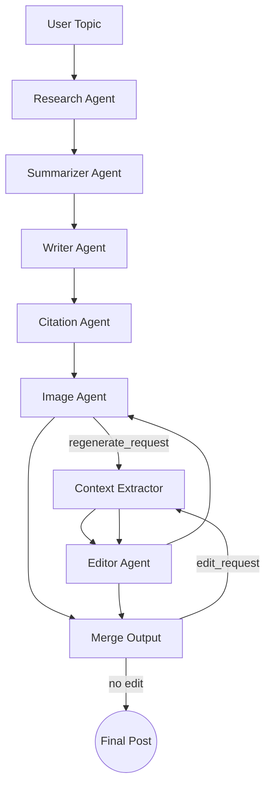

# 🧠 Multi-Agent Blog Writer

This project is an intelligent **blog generation platform** built using a **multi-agent architecture**, enhanced by **LangGraph**, **FastAPI**, and a **React + Tailwind frontend**. It automates the research, summarization, blog writing, citation formatting, and image retrieval processes using modular AI agents.

---

## ✨ Features

- 🧪 Research Agent: Uses SerpAPI to fetch article snippets
- 🧠 Summarizer Agent: Summarizes research into blog-ready notes
- ✍️ Writer Agent: Generates a 1000-word Markdown blog post using GPT or LLaMA
- 🖼️ Image Agent: Pulls high-quality Pexels images relevant to the topic
- 🔗 Citation Agent: Outputs structured reference links
- 🔁 Editor Agent: Allows contextual edit requests using RAG (LangChain + Chroma)
- 🌀 **Regenerate Images**: Users can refresh image suggestions with one click
- 🧠 **LLM Choice**: Use OpenAI GPT (GPT-4o, 4o-mini) or LLaMA (Groq)
- 📄 Backend: FastAPI with endpoints for `/generate`, `/edit`, `/blogs`, `/regenerate-images`
- 🖥️ Frontend: React + Tailwind with live Markdown preview + editing

---

## 🧠 Agents Used

### 1. **Research Agent**
Uses SerpAPI to collect 5 top organic results based on the blog topic.

### 2. **Summarizer Agent**
Summarizes fetched articles into key points using GPT-4o.

### 3. **Writer Agent**
Creates a detailed, structured Markdown blog post from the summarized content.

### 4. **Citation Agent**
Generates properly formatted Markdown links for references.

### 5. **Image Agent**
Fetches 3–4 images from Pexels API relevant to the topic.

### 6. **Merge Agent**
Combines draft, citations, and image links into the `final_post`.

### 7. **Context Extractor Agent**
Builds vector store using Langchain and retrieves blog chunks relevant to an edit request.

### 8. **Editor Agent**
Regenerates and replaces specific sections of the blog based on edit requests.

```bash
cd agents
Python blog_agents.py
```
---
## 🔄 LLM Selection Option

### 🧠 GPT (via OpenAI):
- `gpt-4o`
- `gpt-4o-mini`

### 🦙 LLaMA (via Groq):
- `llama3-8b-8192` _ (for writing)
- `deepseek-r1-distill-llama-70b` _(used via `ChatGroq` for RAG )_

You can select the LLM directly from the frontend dropdown. Backend routes dynamically load the correct agent graph.

All models are enhanced using **advanced prompt engineering** and **RAG** for context-aware edits.

---

## 🖼 Image Regeneration Feature

A **"Regenerate Images"** button is provided on the frontend. Clicking it will:
- Trigger the `image_agent` again.
- Fetch fresh Pexels images using randomized search parameters.
- Automatically re-merge and return the updated blog post.

---

## 💾 Database Save Logic

The system stores blog data to the SQLite database at **two key points**:
1. **Initial Blog Generation** (`/generate`)
2. **Each Edit Submission** (`/edit`)

Image regeneration **does not overwrite** DB unless a new post or edit is triggered.

---

## ⚙️ Backend

- **Framework:** FastAPI
- **Routing:** RESTful endpoints
- **Database:** SQLite via SQLAlchemy ORM
- **Storage:** Blogs, references, images, timestamps
- **LLM Flow:** LangGraph dynamic DAG, editable and extendable

**Endpoints:**
- `POST /generate` — Start a new blog generation flow
- `POST /edit` — Apply edit request to existing blog content
- `GET /blogs` — Fetch all blogs
- `GET /blogs/<built-in function id>` — Get one blog by ID
---

## 🔁 RAG-Driven Edits

Each edit request triggers a **retrieval-augmented generation** pass:
1. Vector search narrows the section of interest.
2. That section is passed to GPT-4o for focused editing.
3. The updated content is merged back into the blog.

This process loops until no further edit requests are received.

---
## 🛠️ Setup & Installation
### Clone the repository

```bash
git clone https://github.com/yourusername/multi-agent-blog-writer.git
cd multi-agent-blog-writer
```

### Backend (FastAPI + LangGraph):
```bash
cd backend
pip install -r requirements.txt
python -m db.init_db
uvicorn main:app --reload
```

### Frontend Setup (React + Tailwind)

```bash
cd frontend
npm install
npm start
```

### Environment Variables:
Create a `.env` in root with:
```env
OPENAI_API_KEY=your_openai_key
SERPAPI_KEY=your_serpapi_key
PEXELS_API_KEY=your_pexels_key
```

---

## 📦 Folder Structure

```
├── backend/
│   ├── main.py
│   ├── db/
│   │   ├── models.py, crud.py, schemas.py
│   ├── langchain_runner.py
│   ├── test_fetch_blogs.py
├── agents/
│   ├── blog_agents.py          # For GPT
│   ├── blog_agents2.py         # For LLaMA
├── frontend/
│   ├── App.jsx, index.jsx, ...
├── .env
├── requirements.txt
```

---

## 🎯 Usage

- Enter a blog topic → click **Generate** → watch Markdown appear.
- You can send **edit requests** like _"Make intro shorter"_, _"Add more examples"_, etc.
- Preview updated blog in real-time.
- All blogs are stored in the SQLite database with references and images.

---
## ✅ Highlights

- Clean modular code: backend, agents, frontend, all decoupled.
- Markdown-based editing and previewing.
- Auto-saving to DB with timestamp.
- Dynamic LangGraph-based workflows with full retry/edit support.

## 🧩 Tech Stack

- **LangGraph + LangChain** (RAG, LLM orchestration)
- **OpenAI & Groq**(GPT & LLaMA clients)
- **FastAPI**
- **SQLite + SQLAlchemy**
- **React + TailwindCSS**
- **SerpAPI + Pexels API**
- **ChromaDB** for vector search

---

## ✅ Tests

Run a test to confirm blogs were saved:

```bash
python backend/test_fetch_blogs.py
```

---

## 🧠 Intelligent Agent Flow



---

## 📦 Requirements

See `requirements.txt`

---
---

## 🧪 Testing

### ✅ Unit Tests
```bash
pytest -v test/___.py
```

### ✅ Test DB Content
```bash
python backend/test_fetch_blogs.py
```

### ✅ Test API
```bash
curl -X POST http://localhost:8000/generate \
     -H "Content-Type: application/json" \
     -d '{"topic": "The Future of Renewable Energy"}'
```
### ✅ Backend Test
```bash
python backend/test_main.py
```

## 📎 API Reference

| Method | Endpoint               | Description                      |
|--------|------------------------|----------------------------------|
| GET    | `/`                    | Health check                     |
| POST   | `/generate`            | Submit topic for blog generation |
| POST   | `/edit`                | Send blog edit request           |
| POST   | `/regenerate_Image`    | Refresh images for a blog        |
| GET    | `/blogs`               | List all blogs                   |
| GET    | `/blogs/{id}`          | Retrieve specific blog post      |

---

## ✅ Final Checklist

| Feature                                      | Status   |
|----------------------------------------------|----------|
| LLM Selection (GPT + LLaMA)                  | ✅ Yes   |
| Multi-agent orchestration with LangGraph     | ✅ Yes   |
| Blog content generation (Markdown)           | ✅ Yes   |
| Citation and Image fetching                  | ✅ Yes   |
| Regenerate Images UI + Backend               | ✅ Yes   |
| Contextual Edit Requests with RAG            | ✅ Yes   |
| DB Storage for generated/edited blogs        | ✅ Yes   |
| Frontend LLM Toggle + Markdown View          | ✅ Yes   |

---

## 👩‍💻 Run Commands Summary

```bash
# Start Backend 
uvicorn backend.main:app --reload

# Start Frontend (in frontend/)
npm start
```

## 👏 Contributing

PRs welcome — let’s build better AI writing tools.

---

## 👨‍💻 Author

Developed by `Narges Vahdani`.